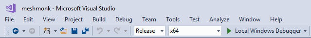
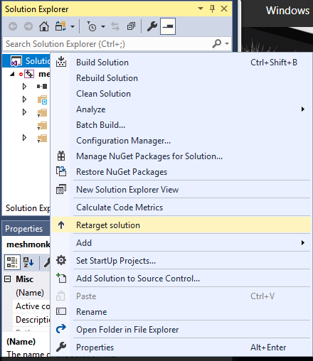
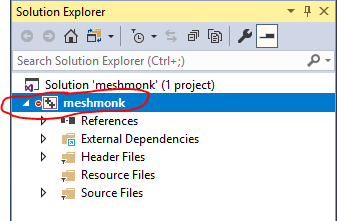

# Build on Windows

This installation guide works on a Windows 10 64bit machine with the
Visual Studio 2017 community edition. Ensure that you have the
**C++/CLI support** installed.

## Install Visual Studio 10

* Go to: https://www.visualstudio.com/downloads/
* Download *Visual Studio Community 2017*
* Double click to run the installer
* The installer will open
  
  In the left pane click the checkboxes of *Universal Windows Platform Development* and *Desktop development with C++*
  In the right page enable the *C++/CLI support* checkbox
* Click on install. This will take while since it needs to download +16GB

## Download meshmonk

* Create a folder called `c:\Users\<username>\Documents\GitHub` if you do not already have it
* Place downloaded/cloned meshmonk files from this GitHub repository into `c:\Users\<username>\Documents\GitHub\meshmonk`

## Install libraries

* [OpenMesh 6.3](http://openmesh.org/download/): download the vs2015 64bit with apps static [installer](http://www.openmesh.org/media/Releases/6.3/OpenMesh-6.3-VS2015-64-Bit.exe)
* [Eigen 3.3.4](http://eigen.tuxfamily.org): download the [source zip](http://bitbucket.org/eigen/eigen/get/3.3.4.zip) and extract in `c:\Users\<username>\Documents\GitHub\eigen-eigen-3.3.4`

## Configure Visual Studio project

### Screencast on how to configure & build

[](https://www.youtube.com/watch?v=L9Us4YlcLxw&feature=youtu.be)

Click on the image to watch the screencast on YouTube.

### Import project
* File -> New -> Project From existing code
* Choose *Visual c++*
* Choose project file location as `c:\Users\<username>\Documents\GitHub\meshmonk`
* Type *meshmonk* as name
* Click *Next*
* Choose Project Type: *Static Library (LIB) project*
* Click *Next*
* Click *Finish*

### Configure Solution
* Choose for Solution Configurations: *Release*
* Choose for Solution Platform: *x64*



### Retarget Solution

* In the *Solution Explorer*
* Right-click on *Solution 'meshmonk'*
* Click on *Retarget solution*
* Choose a *Windows SDK* version higher than 10
* Click *Ok*



### Exclude files from the project
* In the Solution Explorer window, find the following files, then right click each and select *Exclude from project*:
* In the Header Files: 
  * nanaflann.hpp
* In the Source Files:
  * compute_correspondences.cpp
  * compute_inlier_weights.cpp
  * compute_nonrigid_transformation.cpp
  * compute_normals.cpp
  * compute_rigid_transformation.cpp
  * downsample_mesh.cpp
  * example.cpp
  * mystream.cpp
  * nonrigid_registration.cpp
  * pyramid_registration.cpp
  * rigid_registration.cpp
  * scaleshift_mesh.cpp
  * test_meshmonk_mexing.cpp

### Configure properties

When you start configuring the properties you need to make sure that you
have selected the *meshmonk* project. Otherwise the configuration is not
applied to this projects. E.g:



Open *Project -> Properties*:

* Go to *General -> Project Defaults -> Configuration Type*: *change to Static library(.lib)*. Press *Apply*. 
  This changes the *Linker* configuration options to *Librarian*. If this didn't happen, please close and re-open the *Properties*
* Go to *C++ -> General -> Additional Include Directories*: add the following directories, then press *Apply*.
    ```
    C:\Users\<username>\Documents\GitHub\eigen-eigen-3.3.4
    C:\Users\<username>\Documents\GitHub\meshmonk\vendor
    C:\Program Files\OpenMesh 6.3\include
    ```
    This includes Eigen, OpenMesh and Nanoflann.

    **Note**: adapt these paths to the paths where you've installed the
    source code and libraries.
    
* Go to *C++ -> Preprocessor -> Preprocessor Definitions*: type *_USE_MATH_DEFINES* then press *Apply*
* Go to *Librarian -> General -> Additional Dependencies -> edit*:
    ```
    C:\Program Files\OpenMesh 6.3\lib\OpenMeshCore.lib
    C:\Program Files\OpenMesh 6.3\lib\OpenMeshTools.lib
    ```
    **Note**: adapt these paths as well to the paths where you've
    installed OpenMesh.
* Hit *Ok*, then *Apply*, then *Ok*.

### Build project

* Go to *Build -> Rebuild Solution*

This will build the static library. The result `meshmonk.lib` can be
found in `C:\Users\<username>\Documents\GitHub\meshmonk\x64\Release`.

### Matlab

After you've build the library you will have to copy/paste the file to
a folder which is in matlab path. Either the root folder of matlab or
the relative root folder of the matlab files that you're working on. 
